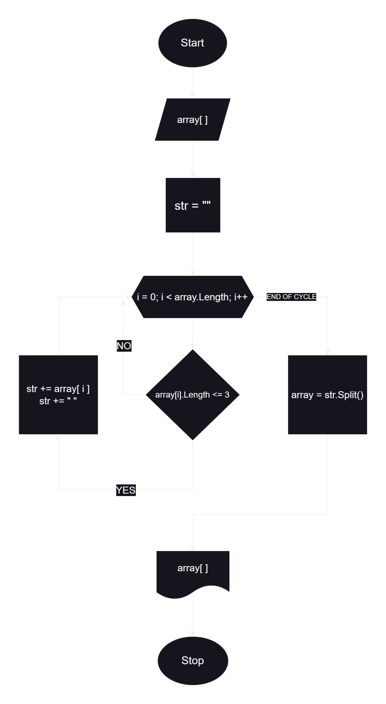

# Итоговая контрольная работа по основному блоку

## Задача

 Написать программу, которая из имеющегося массива строк формирует новый массив из строк, длина которых меньше, либо равна 3 символам. Первоначальный массив можно ввести с клавиатуры, либо задать на старте выполнения алгоритма. 
    При решении не рекомендуется пользоваться коллекциями, лучше обойтись исключительно массивами.

    Примеры:
    
    [“Hello”, “2”, “world”, “:-)”] → [“2”, “:-)”]
    
    [“1234”, “1567”, “-2”, “computer science”] → [“-2”]
    
    [“Russia”, “Denmark”, “Kazan”] → []

## Технические сложности

При запуске программы в операционной системе Windows, может наблюдаться некоректный вывод кирилицы в командной строке или PowerShell. В данном случае может помочь установка последней версии PowerShell (7+), где по умолчанию кодировка на вывод является utf-8. При совершении же ввода стоит полностью избегать ввода кирилицей, иначе командная строка не распознает символы.

Данных сложностей можно полностью избежать при запуске программы в отдельном окне не "родного" для Windows терминала git bash.

## Решение
Для выполнения задачи был использован язык программирования C#. А также для наглядности была составлена блок схема алгоритма, представленная ниже:

### Шаги решения:

1. **Создание первоначального массива строк**

    Для начала при помощи _Console.WriteLine( )_  мы сообщаем пользователю, что необходимо ввести некое количество последовательностей символов отделённых друг от друга пробелами, которые будут счистаться строками. На самом деле вводится всего лишь одна строка посредством _Console.ReadLine( )_, но мы сразу же применяем к ней метод _.Split( )_, который находит пробелы и в их месте разбивает строку на несколько строк, по сути создавая из них массив. Его же мы и записываем в нужную нам переменную. Используемая конструкция сочитания методов выглядит так: `string[] array = Console.ReadLine().Split();`

2. **Написание функции "Сито для строк" (sift_strings)**

    Данная функция принимает на вход в качестве аргумента массив строк. Также для удобства, прямо в параметрах функции обьъявляем переменную _str_, строку, котораю будет использоваться в теле функции, и присваиваем ей значение пустой строки (""). В теле функции цикл **for**, который перебирает все строки из полученного массива и сравнивает их длинны при помощи метода _.Length_ со значением 3. Если длина текущей строки 3 и меньше `if (array[i].Lenght <= 3)`, то она дописуется к строке _str_ `str += array[i]`, затем к строке также дописуется пробел, чтобы служить разделителем `str += " "`. По завершению работы цикла функция возвращает "просеяный" массив строк, сформированный из _str_ методом _.Split( )_.

        string[] sift_strings(string[] array, str="")
        {
            for (int i =0; i < array.Length; i++)
            {
                if (array[i].Length <= 3)
                {
                    str += array[i];
                    str += " ";
                }
            }
            return str.Split();
        }

3. **Написание функции вывода массива (show_array)**

    Так как в C# не представляется возможным распечатать массив целиком одной "командой", как это можно в других языках, мы вынуждены для вывода массива обратиться к каждому его элементу. Для этого пишем функцию типа _void_, которая выполняет действия но не возвращает значений. Используем в ее теле цикл **for** для перебора всех элементов массива и вывода их на экран при помощи _Console.Write( )_, этот метод не вставляет в конце новую линию (как _Console.WriteLine( )_), что позволяет при выводе все элементы массива расположить в одну строку.

        void show_array(string[] array)
        {
            for (int i = 0; i < array.Length; i++)
            {
                Console.Write($"{array[i]} ");
            }
        Console.WriteLine('\n');
        }

4. **Всё воедино**

    Приглашение пользователя к вводу данных с клавиатуры:

        Console.WriteLine("\nВедите любое количество последовательностей символов, разделяя эти последовательности пробелом.");
    
    Создание первоначального массива:
    
        string[] array = Console.ReadLine().Split();

    "Просеивание" массива:

        array = sift_strings(array);

    Вывод изменённого массива:

        show_array(array);